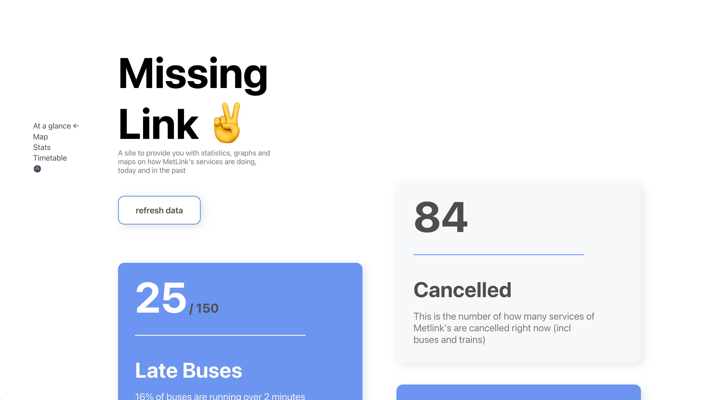

# [MissingLink](https://missinglink.link)

MissingLink is a project designed to track the performance of Metlink's buses over time. It consists of a back-end that polls Metlink's APIs every 20 minutes to collect and display data on Metlink's bus movements and performance.

I found the stats interesting and thought they should be shared with the world, so I built a site to display the information.

  

https://user-images.githubusercontent.com/18430086/196853160-8ed89ae5-3da6-40d3-b974-b0166b4c0391.mp4

## Tech

The front-end is built with React using the NextJS framework and it's hosted on Vercel.

The back-end is built in C# using .Net Core and Postgres for the database, hosted on an EC2 instance in AWS, with Nginx in front.

## Challenges

There's quite a few days when the backend wasn't recording data, this was due to the MetLink API being down during COVID lockdowns, or just plain broken. They obviously use an untyped language on their backed as a few times they had strings in number fields returned in their API which occasionaly took down the C# backend in the early days, this is now handled more gracefully on my end of the API. 
